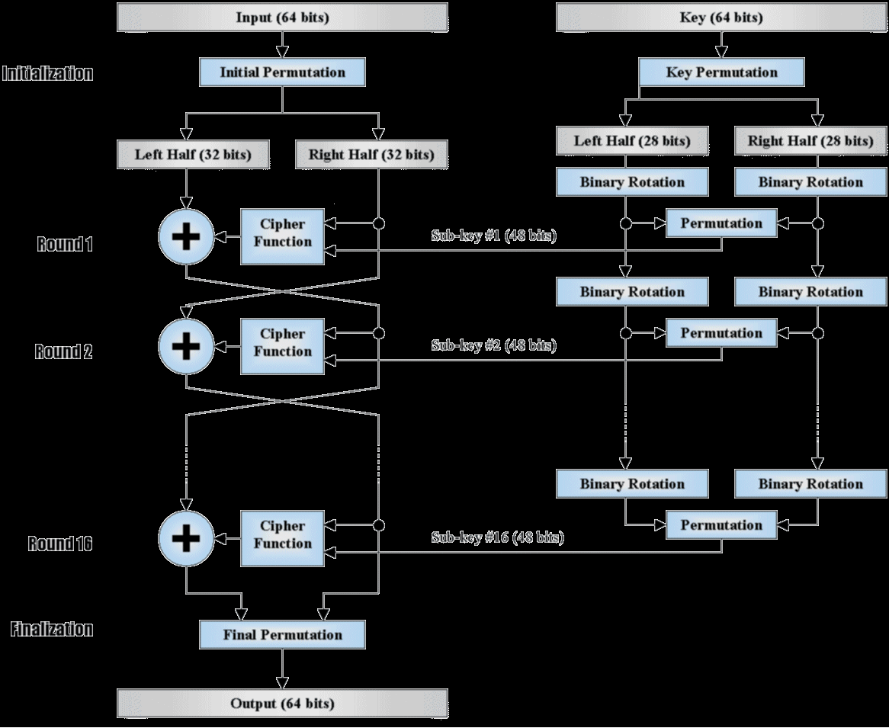

# A Basic Implementation of DES Algorithm 🔐

### This Project was developed during CSE3078 Cryptography and Network Security Coursework, it aims to encrypt data into 16 digits hexadecimal using 16 letters hexadecimal input or 8 digit ASCII Text.

</img>
